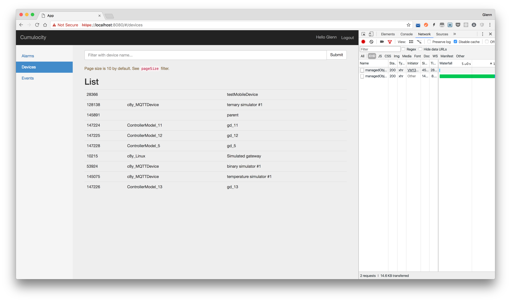

# cumulocity-smart-apps-webpack

[](https://www.npmjs.com/package/cumulocity-smart-apps-webpack)
[](http://npm-stat.com/charts.html?package=cumulocity-smart-apps-webpack)
[](https://raw.githubusercontent.com/dwiyatci/cumulocity-smart-apps-webpack/master/LICENSE.txt)

A boilerplate to conveniently start creating Cumulocity Smart Apps instance and to improve development experience with webpack 3.x.



## ~~ATTENTION: Cumulocity Smart Apps Toolkit is currently in legacy mode as it is based on the old release of UI core JS API (6.3.x). That said, you may still use it and it's up to you to decide whether it works and still well-suited for your particular app.~~ [cumulocity-clients-javascript](https://github.com/Cumulocity/cumulocity-clients-javascript) a.k.a. Cumulocity Smart Apps Toolkit a.k.a. Cumulocity [Web SDK for AngularJS](https://www.cumulocity.com/guides/web/smart-toolkit/) seems to be brought back to life (8.x). It's kinda form of [necromancy](http://www.urbandictionary.com/define.php?term=Necromancy) but I'd still recommend you to [develop plugins](http://cumulocity.com/guides/web/introduction/) as it offers more out-of-the-box features and more convenient for newbs.
 
### Why?
I would like to enhance [the current boilerplate](https://bitbucket.org/m2m/cumulocity-examples/src/fa8077ade64ddb74100296742e739daa258ae9b3/hello-core-api/?at=default) for creating a Cumulocity Smart Apps instance in order to be able to:
- have a cleaner development boilerplate which highly respects some awesome style guides ([John Papa's Angular 1 Style Guide](https://github.com/johnpapa/angular-styleguide/blob/master/a1/README.md), [Airbnb JavaScript Style Guide](https://github.com/airbnb/javascript)).
- leverage package managing and bundling process by getting rid of Bower* and Grunt in favour of npm and webpack.
- showcase the usage of ES6+ in my code in conjunction with AngularJS.
- use npm (scripts) as a build tool.
- improve developer experience with webpack-dev-server 3.x (Code Splitting, Caching, HMR, Tree Shaking, Scope Hoisting, etc.).
- stop repeating the hustle of creating a fiddle of CSA instance when I'm doing support for the guys who are still using the toolkit (yes, **you**! :yum:).

*~~Unfortunately there are some package dependencies which are only available in Bower, including [the toolkit](https://bower.io/search/?q=cumulocity-clients-javascript) itself. So, I cannot migrate 'em all completely to npm. :disappointed:~~

## Usage
- Install Node.js and npm from its [website](https://nodejs.org), or even better: use [nvm](https://github.com/creationix/nvm).

- Install [yarn](https://yarnpkg.com/en/docs/install).

- Checkout the repo, `cd` to project directory, and setup dependencies:
```bash
$ yarn install:clean
```

* For development, start webpack development server with hot reloading capability:
```bash
$ yarn start
```
You'll find the CSA instansce running on https://localhost:8080.

* For production, build frontend static assets:
```bash
$ yarn build
```
Simply drop all files under `assets` directory to your production server.

### Deploying to a Cumulocity tenant
- Build the assets: `yarn build`.
- Zip all files under `assets` directory (:warning: not the directory itself!) and name the ZIP file as "smartapps" or whatever you want to call the app.
- Go to Administration → Own applications → Add application → Upload ZIP file, then drop the app ZIP file from the previous step.

## Author
Glenn Dwiyatcita ([@dwiyatci](http://tiny.cc/dwiyatci))

## License
MIT.

See [LICENSE.txt](LICENSE.txt).
